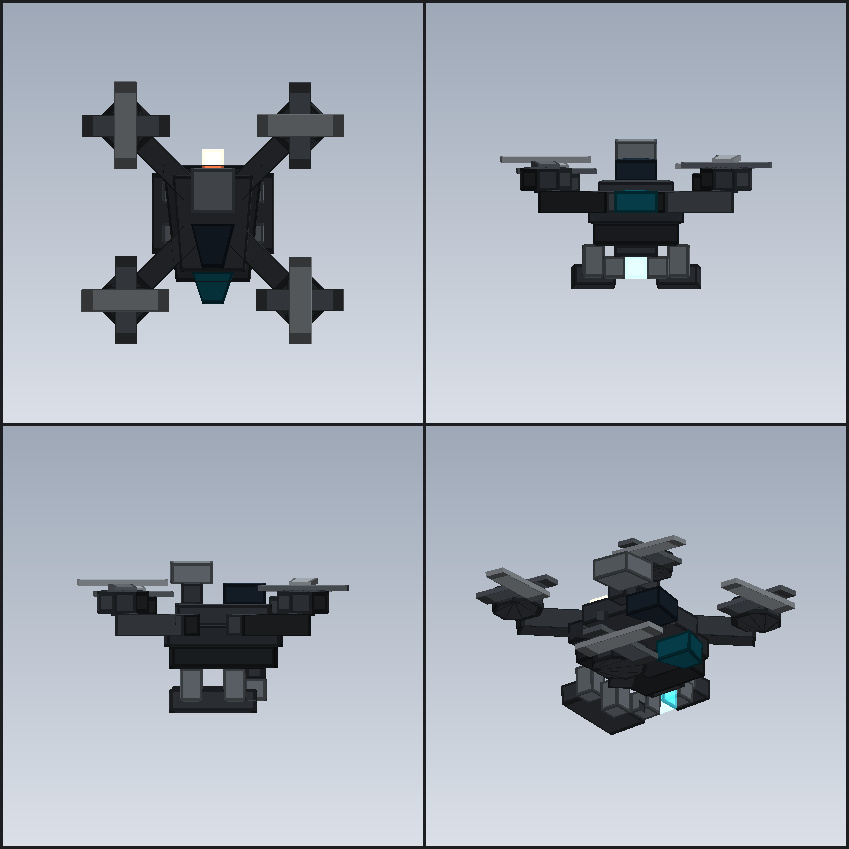

# Watchcraft


**Surveillance tools for Minecraft 1.21.1 + NeoForge.**

Watchcraft is about seeing places you are not. It gives you eyes you can leave behind: gear that
watches a room, a road or a player's back while you are somewhere else entirely, and that tells
you what it saw without asking you to stand there and look.

The first tool is a **recon drone** — deploy it, link into it from anywhere, fly it like you fly
yourself, and every creature that wanders into its view gets lit up so you can mark it. Throw one
with a single key to scout ahead without ever leaving your body.

It is not meant to stay the only one. **Pinhole cameras and other instruments are on the way**, and
the drone is built to be the reference the rest of them follow rather than a one off.



## Tools

| Tool | Status | What it gives you |
| --- | --- | --- |
| **Recon drone** | Shipping | A flyable camera on a 64 block leash. Deploy it, link in from anywhere, and everything it looks at gets outlined. Takes modules, up to and including a warhead. |
| **Pinhole camera** | Planned | A camera mounted on a wall and tuned into rather than flown. No flight and no leash — just one fixed view of a room, from a spot nobody thinks to check. |
| **Viewing terminal** | Idea | A block that shows the feed of any instrument you have linked. Somewhere to actually watch from. |
| **Motion sensor** | Idea | A tripwire with a cone. Reports movement across its whole field instead of lighting up a single block. |
| **Tracker tag** | Idea | A dart that sticks to a creature and keeps reporting where it went. Marking, but permanent. |

Status is intent, not a schedule. Shipping means it is in the jar today; planned means it is the
next thing up; idea means it is being kicked around and may change shape or never happen.

## What ties them together

Every instrument is meant to plug into the same handful of systems, so that adding one feels like
adding a part rather than adding a mod:

- **The leash and the signal model.** Distance degrades the feed and past the leash you lose it.
  Already built for the drone, and the shape every remote instrument reuses.
- **The visor.** One HUD, one reticle, one key strip, drawn *under* the signal overlay so the
  instruments stay readable when the picture does not.
- **The Module Workbench.** One bench, one loadout mask carried on the item stack, one
  prerequisite rule. New instruments bring new boards.
- **Server authority.** Clients send intent and nothing else. Ownership checks, packet rate caps
  and collision sweeps all happen on the server.
- **Generated assets.** Every mesh, texture and shader comes out of `tools/`. A new instrument is
  a new generator, not a new binary blob.

## The recon drone

The rest of this README is the drone — the reference implementation, and the only instrument
shipped so far.

### Controls

| Key | Action |
| --- | --- |
| Right click a block | Deploy a drone hovering in front of that face |
| Right click air | Throw a drone forward (same as the throw key) |
| Sneak + right click a drone | Pack it back up into the item |
| **V** | Link in / link out (camera hops to the drone) |
| **G** | Throw the drone in your hotbar, or the first one in your inventory |
| **R** | Recall the drone — folds it back into your inventory from any distance |
| **W A S D** | Fly — forward is *where the camera points*, pitch included |
| **Space / Shift** | Climb / descend, straight up and down in world space |
| Right click *while piloting* | Drone reaches out and works a door / trapdoor / fence gate in front of it |
| **Sprint key** *while piloting* | Charge attack — needs an Attack Module fitted (see below) |

All three mod keys are rebindable under *Options → Controls → Recon Drone*. The charge uses
vanilla's own sprint binding, and the visor spells it out.

### Commands

| Command | Effect |
| --- | --- |
| `/watchcraft doorinteract` | Print whether pilots may open doors |
| `/watchcraft doorinteract true` | Let pilots open doors, trapdoors and fence gates |
| `/watchcraft doorinteract false` | Turn that off — right click does nothing from the cockpit |

The setting is stored with the world, so it survives a restart.

### How it behaves

- **One drone at a time.** You can only ever have a single drone out in the world, and only
  that drone can be piloted. Trying to deploy or throw a second one just prints a message.
- **Remote control.** While linked, your body stops dead where it is, keeping the heading it had
  when you linked in — the body and head angles are pinned along with the yaw, so the player model
  does not swing around while you fly. Mouse look drives the drone, and the drone's camera is fully
  first person: your own arm and held item are hidden.
- **Clicks stay in the cockpit.** Left click, right click, middle click and the scroll wheel all
  do nothing to the player while piloting — no items used, no blocks placed, nothing attacked,
  no hotbar slot changed. A right click instead casts a 5 block reach **from the drone**; only
  doors, trapdoors and fence gates respond. Boats, beds, chests, workbenches and everything else
  are deliberately out of reach.
- **The inventory is off limits too.** `E` and the `1`–`9` hotbar keys are swallowed while
  piloting, along with `Q` and `F`. This is a cosmetic rule rather than a mechanical one: an
  inventory screen obviously breaks the visor, and even a plain hotbar change is enough, because
  vanilla pops the item's name up in the middle of the screen for a moment afterwards. Linking in
  from behind an open screen closes it.
- **The view sets the direction, not the speed.** Forward is the full view vector with pitch
  included: aim at the sky and hold forward and the drone climbs, aim at the ground and it
  descends. `A` / `D` sidestep along the flattened heading so they never peel off into a dive,
  and `Space` / `Shift` are plain world-space vertical. Diagonals are normalised so holding two
  keys does not stack past cruise speed. **With nothing held the drone does not move at all** —
  turning the camera while parked will not budge it, which is the difference between flying a
  recon drone and flying a helicopter.
- **Momentum.** The keys feed a *target* velocity, and the real velocity chases it quickly when
  accelerating but slowly when slowing down. That asymmetry is the whole trick: let go mid
  flight and the drone keeps drifting about a block over half a second before it settles,
  instead of stopping dead. Hit a wall and the coast is dropped so it does not grind along the
  surface.
- **Banking.** Turning rolls the drone into the turn. Every client derives that lean from the
  rotation stream it already receives, so it costs no extra packets and bystanders see exactly
  what the pilot sees.
- **It can be shot down.** The airframe has **10 hit points** (five hearts). Any damage source
  that is not blocked by invulnerability hurts it, with a 10 tick immunity window after each hit
  so it cannot be burst down in one combo. Hits flash it red and clank. At zero it goes down in
  smoke and sparks, drops its airframe for the owner to pick back up, and the link drops
  instantly. Whatever modules were fitted come back with it.
- **Immune to every status effect.** This is structural rather than bolted on: the drone extends
  `Entity`, not `LivingEntity`, so potions, area effect clouds and `/effect` all resolve their
  targets as a `LivingEntity` and never reach it. It is also `fireImmune()`, so fire cannot
  touch it either.
- **Visor readout.** The reticle is a single dot with a one pixel dark halo, so it stays legible
  against snow, cloud and sky. The HUD shows exactly four numbers: the drone's X, its Y, its
  distance from you, and its remaining hit points. The distance turns amber once you pass 75% of
  the link leash; the hit points turn red below 30%. The key strip along the bottom replaces the
  vanilla experience bar while piloting.
- **Signal breakup.** The picture starts to hiss at **48 blocks** and degrades one grade every
  **4 blocks**, so 52 is a quarter gone, 56 half, 60 three quarters, and at **64** — the end of
  the leash — the feed whites out and a blinking `SIGNAL LOST` banner takes over.
  The defocus is a **real** one: the world is blurred before the GUI is drawn, by a post chain
  (`assets/watchcraft/shaders/post/drone_link.json`) whose passes all name vanilla's own
  `box_blur` program, with the radius driven off the same 0-to-1 degradation figure the overlay
  uses. Nothing is compiled or registered from Java — it is one JSON file and a uniform write.
  It runs at `RenderLevelStageEvent.AFTER_LEVEL`, which is *before* `doEntityOutline` composites
  the glow of every marked entity, so the world goes soft while **the glow and the readouts stay
  crisp**. That ordering is load bearing rather than incidental: a glowing entity is never drawn
  into the main target at all, only into the outline buffer, so what you actually see is a thin
  white edge — blurring it drops its peak brightness by an order of magnitude and the mark
  collapses into a dark smear.
  The overlay on top of the blur is an analogue style mix of a milky wash, a stacked vignette,
  a few torn horizontal scan lines and **one pixel** grain, reseeded 25 times a second so it
  flickers like a struggling transmission instead of averaging into flat grey at high frame rates.
  The grain is deliberately fine and the softness comes from the shader: a screen space imitation
  can lift the blacks and darken the corners, but `GuiGraphics` only fills flat colour, so it can
  never actually soften an edge — and contrast lifting alone just reads as dust on a sharp
  picture. The lines are punctuation, not the effect: real analogue interference is overwhelmingly
  speckle, and an earlier pass that drew ten of them per grade read as venetian blinds rather than
  as a failing feed. The whole effect is drawn *under* the frame and readouts, so you lose the
  picture, not the instruments.
- **Your body stays put.** Linking in mid sprint, mid jump or mid walk does not leave the player
  skidding, drifting or strolling on their own. Sprint is cancelled, the movement input triple is
  zeroed, the sideways drift is dropped every tick and the fall distance is cleared, so the body
  simply drops to the ground under its own weight and lands for free. Zeroing the input has to be
  done on the body rather than in the movement input event: vanilla only copies the event's values
  into the body while the camera is on it, so with the camera on the drone a leftover input value
  is never overwritten, only decayed — a body linked in mid walk keeps walking, gently, for a few
  seconds. The *vertical* velocity is deliberately left alone: gravity is only worth 0.078 blocks
  a tick, so cancelling the velocity every tick would cancel the acceleration with it and the body
  would sink at walking pace, which reads as floating. The position is never written to at all —
  an earlier version pinned the body onto the spot it landed on, and the pin engaged at exactly
  the tick it touched down, fighting the landing physics and showing up as a stutter. It bought
  nothing anyway, since a body with no input and no sideways velocity has nothing left to move it.
  The body's position is reported to the server every tick it changes, because vanilla stops
  reporting a player's position the moment the camera moves to something else — without that, the
  whole drop would arrive as one jump on the tick you dismount and be charged as fall damage.
- **Marking.** Any living entity inside a 110° cone, within 48 blocks, with an unobstructed line of
  sight is tagged as glowing for 60 ticks. Keep it in view and the glow keeps refreshing; look away
  and it fades out about three seconds later. Anything within 8 blocks is lit regardless of the
  angle — it is in frame whether or not the drone happens to be pointing at it. The sweep runs every
  two ticks, and line of sight is tested against the nearest face of the target's box before its
  centre, so a fence post or a lip of ground between the two does not hide a target the drone can
  plainly see.
- **Thrown drones scout too.** A thrown drone flies ballistically, points itself along its
  flight path and keeps scanning, then hovers where it ends up. You can link into it later. A
  thrown drone scans with a wider 150° cone and a 16 block no-aim radius, because it tumbles along
  its arc and a cone tight enough to feel like aiming slides straight past what it just flew over.
- **Link leash.** If you walk more than 64 blocks away, or the drone is destroyed, or you
  die, the link drops automatically and your camera returns to your body.
- **Server side validation.** Movement is client driven (like the vanilla player) but the
  server clamps the distance per tick, enforces the leash, and requires you to own the drone
  before it will accept a link request. Glow scanning and door opening both run on the server,
  so they cannot be faked by a modified client. Move packets get six checks: owner, finite
  numbers, per packet step, leash range, **one packet per tick**, and a **block collision sweep**
  run with the same routine `Entity#move` uses. The step limit alone bounds a single packet rather
  than the packet rate, so the per tick cap is what stops a client from buying speed by
  spraying packets; the sweep is what stops it from claiming to be on the far side of a wall.
  A stock client has already run that exact sweep before sending, so neither check costs it
  anything. Mid charge the packet is still accepted — it carries the aim, which the server clamps
  onto the run's cone — but the position in it is discarded and the leash check is skipped, since a
  committed one way run covers far more ground than the link reaches.

### Modules

A drone is a bare airframe until it is fitted out. Modules are seated at the **Module Workbench**:
put a drone in the left well, a board in the middle one, and the finished drone appears in the
right one to be taken out. The bench takes one board at a time and never destroys anything — close
the screen with something still in it and it comes back to you.

| Module | Requires | Effect |
| --- | --- | --- |
| **Drone Customization Module** | — | The fitting bay. Nothing else can be installed without it. |
| **Attack Module** | Customization Module | Charge attack from the cockpit. |

The prerequisite is real: the bench simply produces no output for an Attack Module on a drone that
has not been opened up first, and a board the drone already carries produces no output either — one
of each, in the right order.

**The loadout travels with the airframe.** Deploy it, throw it, get it shot down, pack it back up,
save and reload — the drone comes back with the same boards in it. That is why the mask lives on
the item stack rather than on the entity: every one of those transitions builds a brand new
`ItemStack`, and anything kept only on the entity would be gone at the first one.

#### Charge attack

With an Attack Module fitted, press the sprint key while piloting. The drone spools up and commits
to a **straight run along whatever the crosshair was pointing at** — no pitch floor, so a level aim
flies level. From that moment the airframe belongs to the server: it owns the position and flies the
line itself, at roughly six times cruise speed, for up to three seconds or until the nose finds
something.

The pilot is not a passenger, though. The axis is locked at launch but the aim can be **bent up to
16° off it**, so the run is a committed charge you can still nudge onto a moving target rather than
a ballistic missile. The aim is **damped** rather than bolted to the mouse: the raw movement feeds a
desired angle and the crosshair chases it on a short first order lag, the same shape as vanilla's
cinematic camera. On a cone this tight that is what makes it feel *tight* rather than twitchy — the
crosshair spends its time near the middle of the envelope instead of slamming into the edge and
sticking there. At the edge further movement is simply discarded, so bringing the mouse back moves
the crosshair at once with no invisible backlog to unwind.

The client clamps to that 16° cone and the server clamps to a deliberately wider 22° envelope, so an
honest pilot is never clamped twice and a modified client gets a slightly longer nudge rather than a
free turn. Both sides clamp against the same published axis, which is what stops the crosshair and
the airframe's real heading from drifting apart.

The **view pulls open by 30%** for the duration, eased in over a fraction of a second rather than
snapped, so the run reads as acceleration. It is a plain `ViewportEvent.ComputeFov` hook, applied at
the very tail of `GameRenderer#getFov` — after the configured FOV, the sprint animation and
`fovEffectScale` — so nothing downstream recomputes the projection and throws the change away.
**Speed streaks** sweep outward from the middle of the screen at the same time, driven by the same
ramp so the two cannot come in or out of step. Each streak keeps its own lane and its own speed —
the angles come from a hash of the slot index rather than a random source, because a fresh random
angle every frame reads as noise rather than as motion — and each fades in as it leaves the middle
and out again as it reaches the edge. Both halves are drawn under the frame and the readouts, so the
instruments stay crisp while the picture tears past.

Whatever the nose touches first takes **20 points of explosive damage**, and the blast breaks a
small crater.

Protection and Blast Protection reduce that exactly as they would a creeper: the damage is delivered
as an explosion, just with a flat figure instead of vanilla's distance falloff. That override is the
point — a warhead that does twenty at the point of impact and four at the edge cannot be aimed at
anything in particular. The crater is kept small by clipping *block* damage to the impact point,
not by shrinking the blast: the radius still governs who gets caught.

**Nothing survives the run.** The airframe, the rotors and both boards go up with the warhead — a
charge is a one way trip, so spending it costs the drone outright. Being shot down is the cheap
ending; this is not.

It is also entirely server side. The client only asks; the server checks that the warhead is
actually fitted, that the caller is actually the pilot, and that the warhead is off cooldown before
committing. Mid run the server flies the airframe and discards the pilot's reported position — the
pilot's copy of the drone chases the server's rather than snapping to it, so the run renders at
frame rate instead of stepping at tick rate. Only the rotation in that packet is used, and only
after it has been clamped onto the cone.

There used to be a second trigger — a double tap of forward — and it is gone. With the run no longer
a stoop, forward is the axis the pilot is about to lock, and putting a destructive action on the same
key that flies the drone was a bad idea.

### Crafting

The drone is assembled from two parts, and each part is crafted on its own first.

```
Module workbench                   Drone chassis
 I I I     I = iron ingot           . I .     I = iron ingot
 I R I     R = redstone             I R I     R = redstone block
 I I I     . = empty                . I .     . = empty
```

```
Drone propeller                    Recon drone
 . N .     N = iron nugget          P . P     P = drone propeller
 I = iron ingot                     . C .     C = drone chassis
 . I .                              P . P
```

```
Customization module               Attack module
 . I .     I = iron ingot           . G .     G = gunpowder
 R A R     R = redstone             I T I     I = iron ingot
 . I .     A = amethyst shard       . G .     T = tnt
```

## Building

Needs a **JDK 21** — nothing else. The Gradle wrapper fetches its own distribution, and the
toolchain resolver downloads a JDK if the machine does not already have one.

```bash
./gradlew build          # jar lands in build/libs/Watchcraft-1.0.0.jar
./gradlew runClient      # dev client
./gradlew runServer      # dev server
```

## Assets

Every texture, model and shader in the mod is generated from source by the scripts in `tools/`.
They use nothing but the Python standard library — no Pillow, no numpy, no 3D library — so the
whole pipeline runs on a bare interpreter.

| Script | Does |
| --- | --- |
| `generate_drone_mesh.py` | Builds the OBJ/MTL pair and the UV manifest. The palette lives here and nowhere else. |
| `generate_textures.py` | Paints every PNG: entity sheets from the manifest, item and block icons, the workbench GUI, the pack logo. |
| `verify_mesh.py` | Checks the mesh against the modelling spec — winding, budgets, symmetry, coplanar faces, UV packing. |
| `preview_mesh.py` | Renders the model to PNG offline, both render types, so a packing mistake shows up without launching the game. |
| `preview_static.py` | Renders the signal-loss overlay offline, blur included, for tuning the veil, vignette and grain. |
| `paths.py` | Where everything lives, resolved once for all of the above. |

Every script runs with no arguments, from anywhere:

```bash
python tools/verify_mesh.py            # 0 failures, 0 warnings on a clean tree
python tools/preview_mesh.py           # build/preview/drone-preview.png
python tools/preview_static.py         # build/preview/static-preview.png
```

Changing the model is a two command loop:

```bash
python tools/generate_drone_mesh.py --install   # build/meshgen, then copy into the repo
python tools/generate_textures.py
```

`--install` copies the OBJ/MTL pair to `src/main/resources/assets/watchcraft/models/entity/` and the
manifest to `tools/`, which is where the texture painter, the preview and the verifier all look for
it. The manifest is a hundred kilobytes of build metadata, so it lives beside the scripts rather
than inside the jar.

## Layout

```
src/main/java/dev/watchcraft/watchcraft/
  entity/     ReconDroneEntity (the airframe), DroneControlState
  item/       ReconDroneItem, DroneModuleItem, DroneModules (the loadout mask)
  block/      ModuleWorkbenchBlock
  menu/       ModuleWorkbenchMenu
  network/    payloads + server bound handling
  command/    ModCommands  (/watchcraft doorinteract)
  server/     DroneSettings (world scoped rules, saved with the world)
  client/     DroneController, DroneHud, DroneSignal, renderer, rig, meshes, keys, events, bench screen
  registry/   items, blocks, entities, menus, data components, creative tab

src/main/resources/assets/watchcraft/
  models/entity/    drone.obj + drone_glow.obj + their MTLs
  shaders/post/     the signal defocus post chain
  textures/         generated
  lang/             en_us, zh_cn

tools/        the asset pipeline (Python, standard library only)
docs/         design notes, including the full modelling spec
```

## Tuning

Everything worth tweaking lives at the top of
`src/main/java/dev/watchcraft/watchcraft/entity/ReconDroneEntity.java`:

| Constant | Meaning |
| --- | --- |
| `MAX_DEPLOYED` | How many drones one player may have out at once |
| `LINK_RANGE` | How far the pilot may stray before the link drops |
| `SCAN_RANGE` / `SCAN_FOV` / `PING_RADIUS` | Detection cone, and the radius inside which angle does not matter |
| `THROW_SCAN_FOV` / `THROW_PING_RADIUS` | The wider pair a tumbling thrown drone uses |
| `GLOW_DURATION` / `SCAN_INTERVAL` | How long a mark lasts / how often it refreshes |
| `FLIGHT_SPEED` | Blocks per tick while piloted |
| `INTERACT_RANGE` | How far the drone can reach when the pilot right clicks |
| `THROW_SPEED` / `THROW_TICKS` | Thrown drone launch speed and ballistic phase length |
| `MAX_HEALTH` | Hit points (10 = five hearts) |
| `HURT_INVULNERABLE_TICKS` | Immunity window after each hit |
| `BANK_GAIN` / `MAX_BANK` / `BANK_SMOOTHING` | How hard the drone leans into its turns |
| `STATIC_ONSET` / `STATIC_STEP` | Where the snow starts and how many blocks each grade lasts |
| `MAX_STEP` | Hard cap on a single client reported move, in blocks |
| `CHARGE_SPEED` / `CHARGE_MAX_TICKS` | How fast a run flies, and how long it may run before it gives up |
| `CHARGE_CONE` / `CHARGE_CONE_SLACK` | How far the pilot may bend the run off its axis, and the wider envelope the server allows |
| `CHARGE_DAMAGE` / `CHARGE_EXPLOSION_RADIUS` / `CHARGE_CRATER` | Blast damage, who it reaches, and how much it breaks |
| `CHARGE_COOLDOWN_TICKS` | How often the warhead may be re-armed |
| `CHARGE_ECHO_CHASE` | How much of the gap to the server's position the pilot's client closes per tick |

The module bit flags and the prerequisite rule are in `item/DroneModules` and
`item/DroneModuleItem`. Adding a third module is a new bit plus a prerequisite — nothing else has
to change.

The momentum lives in `client/DroneController` (`DRIFT_ACCEL`, `DRIFT_DECEL`). Raising
`DRIFT_DECEL` makes stops snappier, lowering it makes the drone coast further. The charge aim
damping and the FOV kick are there too: `CHARGE_AIM_TAU` is how long the crosshair takes to catch
up with the mouse, `CHARGE_FOV_GAIN` is how much wider the view goes and `CHARGE_FOV_EASE` is how
many frames it takes to get there. The speed streaks share that ramp and their shape lives in
`client/DroneHud` (`STREAK_COUNT`, `STREAK_INNER`) — raise the count for a denser rush, raise the
inner radius to keep them off the middle of the screen.

The strength of the signal defocus is `MAX_RADIUS` in `client/DroneSignal` — the widest blur, in
pixels, at full signal loss. The pass schedule that turns it into a smooth falloff (three
horizontal/vertical pairs at 1.0, 0.5 and 0.25) lives in
`assets/watchcraft/shaders/post/drone_link.json`. The screen-space half of the effect is in
`client/DroneHud#drawStatic` and `#drawVignette`; if the picture ever looks milky rather than
merely degraded, the veil ceiling (`0x50`) is the first thing to lower.

The turn lean's *direction* is a single constant, `DroneRenderer.BANK_SIGN`. If the drone ever
looks like it is banking out of its turns rather than into them, flip that and nothing else.

Which blocks a right click may touch is a whitelist in `ModNetwork#interact` — add another
`instanceof` there to widen it.

Door sounds are echoed straight to the pilot by `ModNetwork#echoDoorSound`, unconditionally.
This is not a range fix: `DoorBlock#playSound` passes the player to `Level#playSound` as the
*except* argument, and that overload treats a Player as a recipient to exclude, so the pilot is
filtered out of the vanilla broadcast no matter how close they stand. Opening a door from the
cockpit is silent by construction.

Which keys are swallowed lives in `DroneController#swallowUiKeys`, called from
`ClientTickEvent.Pre`. That event fires at the head of `Minecraft#tick`, ahead of the vanilla
`handleKeybinds`, which is the only point early enough to work — doing it from
`ClientTickEvent.Post` would be too late, the screen would already be open.

## Docs

- [`docs/detailed-model-obj-plan.md`](docs/detailed-model-obj-plan.md) — the full modelling spec:
  every part, its pivot, its face budget and the source line that proves the API it relies on.
- [`docs/model-and-animation.md`](docs/model-and-animation.md) — how the rig works and what is
  still missing.
- [`docs/obj-modelling-brief.md`](docs/obj-modelling-brief.md) — the conventions a new part has to
  follow, and why parts interpenetrate instead of abutting.
- `docs/drone-preview.png`, `docs/drone-uv-layout.png` — the model and its texture atlas, both
  regenerable with `python tools/preview_mesh.py`.

## License

MIT — see [LICENSE](LICENSE).
